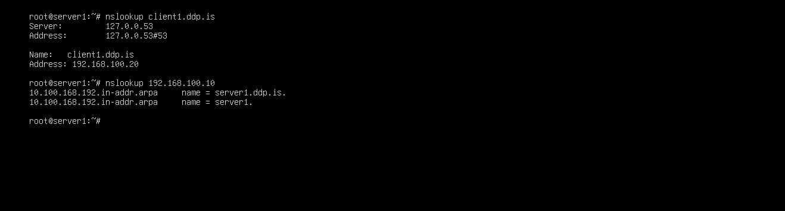
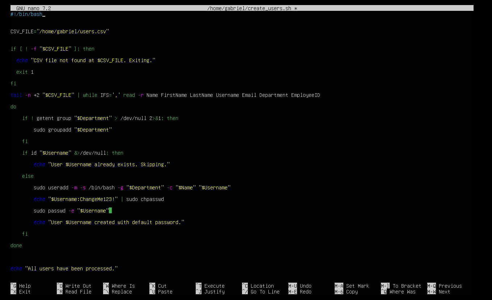
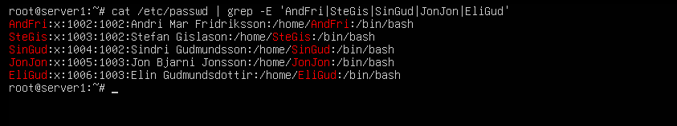
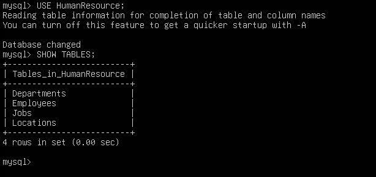
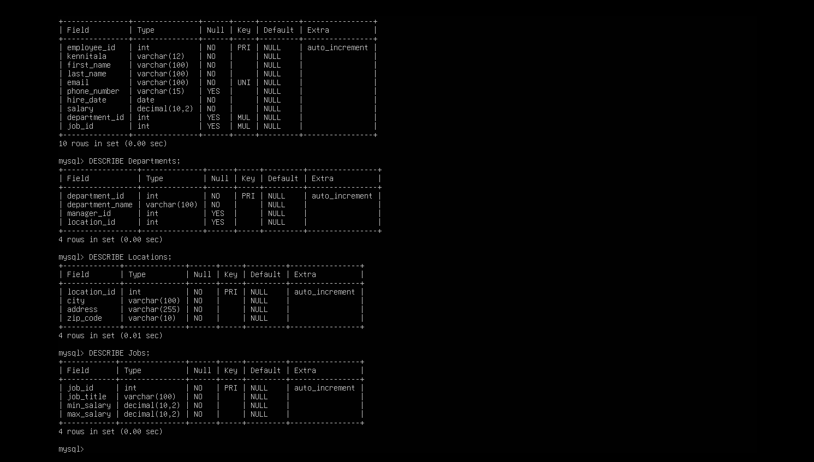
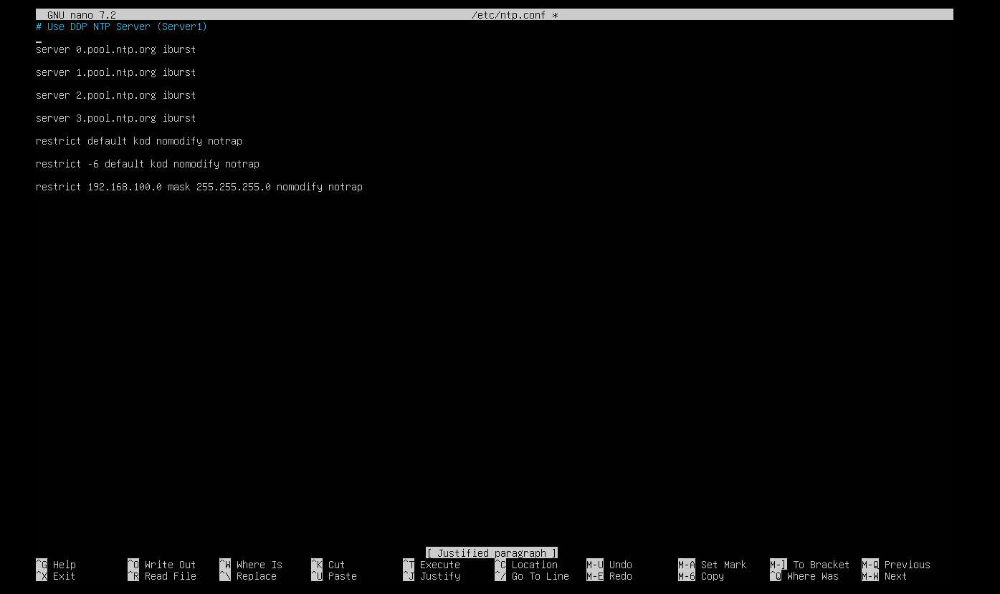
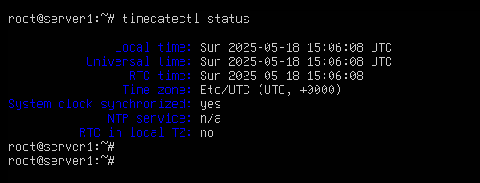

# KEST3LN05EU-Hát Linux - netstjórnun

## Introduction
This project involved setting up and configuring a Linux server, Server1, and two clients, Client1 and Client2, for the domain `ddp.is`. This document provides a detailed walkthrough of the configuration process, including network setup, user management, DNS, DHCP, MySQL database creation, secure SSH configuration, and more.

---

## 1. Initial Network Configuration
We began by setting the hostnames for each machine:
- Server1: `server1.ddp.is`
- Client1: `client1.ddp.is`
- Client2: `client2.ddp.is`

Hostnames were configured throug startup, or by editing the `/etc/hostname` and `/etc/hosts` files on each machine. The static IP configuration for Server1 was set using a network configuration file. This IP was assigned as 192.168.100.10.

---

## 2. Configuring DHCP on Server1
The DHCP server was installed and configured to provide IP addresses to Client1 and Client2 automatically. The DHCP configuration was defined to use a range of IP addresses, with the server itself acting as the gateway and DNS server.

---

## 3. DNS Configuration on Server1
DNS was set up using BIND9. A forward zone was created for `ddp.is`, and a reverse zone was set up for IP address resolution. This configuration allowed hostname-to-IP and IP-to-hostname resolution within the network.

---

## 4. User Creation with a Script
A script was created to automate user account creation based on a list of users provided in a CSV file. The script read the CSV file and automatically created users with a default password.

 
 
A few Users that were created:

---

## 5. MySQL Human Resource Database Setup
MySQL was installed on Server1, and a Human Resources database was created. This database contains tables for employees, departments, jobs, and locations. Each table was structured to store relevant employee information.

---

## 6. Automated Weekly Backup
A backup script was created to automatically back up user home directories every Friday at midnight. This was managed using a crontab entry on Server1.

---

## 7. NTP Time Synchronization
The Network Time Protocol was configured on Server1 as the master server, and both clients were set to sync their time with the server. This ensures all systems maintain accurate and synchronized time.

---

## 8. Centralized Logging with Syslog
Syslog was configured on Server1 to receive logs from Client1 and Client2. This allows centralized monitoring of log files for proactive management.

---

## 9. Postfix and Roundcube Email Setup
Postfix was installed as the email server, and Roundcube was set up as a webmail client. This allows users to send and receive emails within the network using their `ddp.is` email addresses.

---

## 10. Securing SSH with RSA Keys
SSH was secured using RSA key-based authentication. Password authentication was disabled, and only users in the IT and Management groups were granted SSH access.

---

## 11. Securing the System with UFW and Nmap
Uncomplicated Firewall (UFW) was used to secure the server by allowing only necessary ports:
- SSH (22)
- HTTP (80), HTTPS (443)
- SMTP (25), IMAP (143)
- DNS (53)
- NTP (123)
- Syslog (514)
- CUPS (631)

Nmap was used to verify that only these ports were open.

