# DDP Linux Server Setup (KEST3NL05EU)

## Introduction
This project involved setting up and configuring a Linux server (Server1) and two clients (Client1 and Client2) for the domain `ddp.is`. This guide provides a detailed walkthrough of the configuration process, including network setup, user management, DNS, DHCP, MySQL database creation, secure SSH configuration, and more.

---

## 1. Initial Network Configuration
We began by setting the hostnames for each machine:
- Server1: `server1.ddp.is`
- Client1: `client1.ddp.is`
- Client2: `client2.ddp.is`

Hostnames were configured by editing the `/etc/hostname` and `/etc/hosts` files on each machine. The static IP configuration for Server1 was set using a network configuration file. This IP was assigned as 192.168.100.10.

- **Reference Screenshot:** 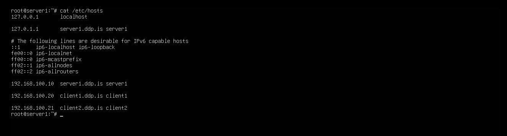
- **Reference Screenshot:** 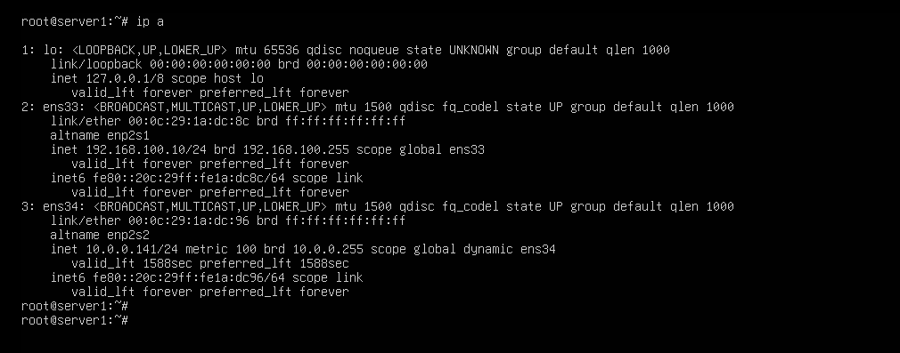

---

## 2. Configuring DHCP on Server1
The DHCP server was installed and configured to provide IP addresses to Client1 and Client2 automatically. The DHCP configuration was defined to use a range of IP addresses, with the server itself acting as the gateway and DNS server.

- **Configuration File:** `config_files/dhcpd.conf.txt`
- **Reference Screenshot:** 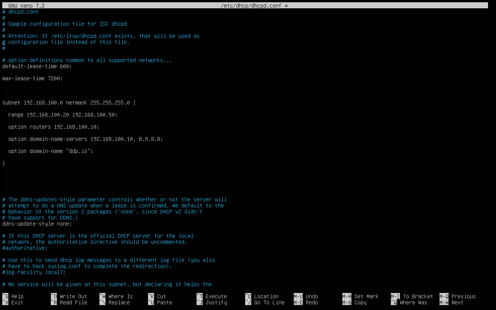
- **Reference Screenshot:** 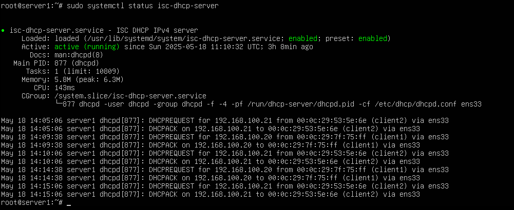

---

## 3. DNS Configuration on Server1
DNS was set up using BIND9. A forward zone was created for `ddp.is`, and a reverse zone was set up for IP address resolution. This configuration allowed hostname-to-IP and IP-to-hostname resolution within the network.

- **Configuration Files:** `config_files/named.conf.local.txt`, `config_files/server1.ddp.is.db.txt`, `config_files/reverse.ddp.is.db.txt`
- **Reference Screenshot:** 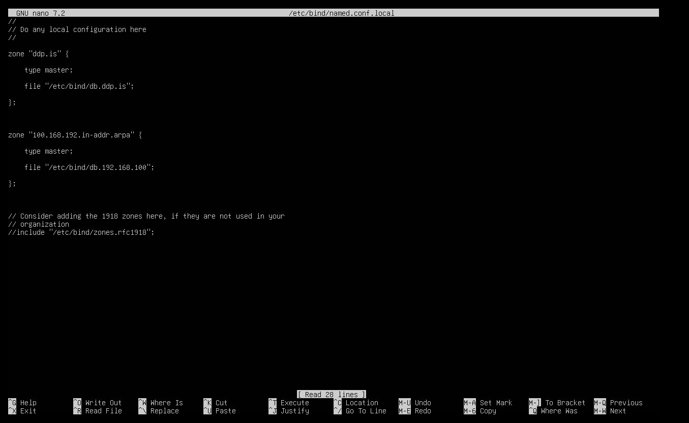
- **Reference Screenshot:** 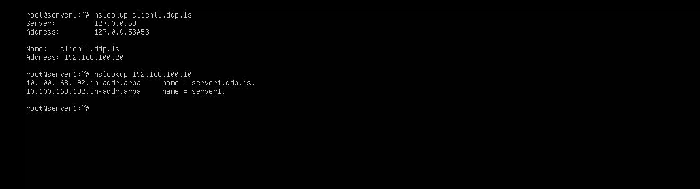

---

## 4. User Creation with a Script
A script was created to automate user account creation based on a list of users provided in a CSV file. The script read the CSV file and automatically created users with a default password.

- **User Creation Script:** `scripts/create_users.sh`
- **Reference Screenshot:** 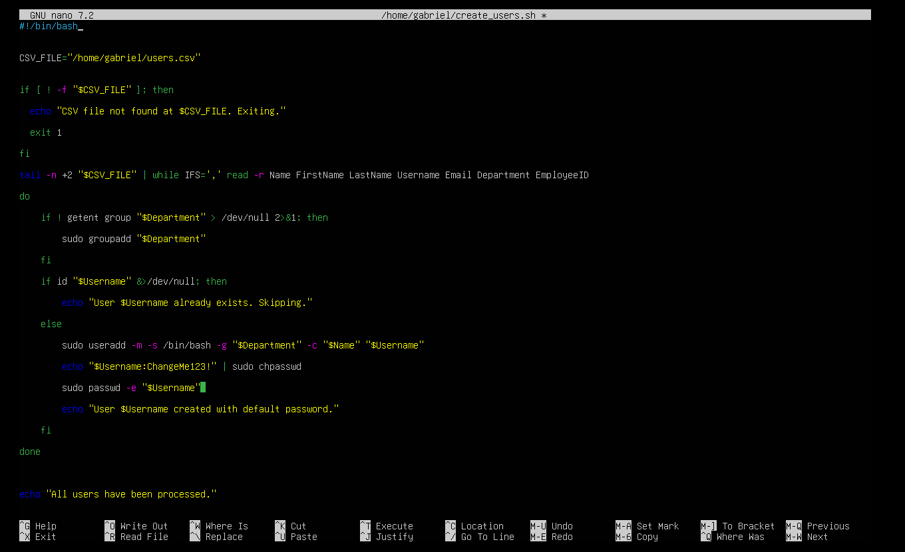
- **Reference Screenshot:** 

---

## 5. MySQL Human Resource Database Setup
MySQL was installed on Server1, and a Human Resources database was created. This database contains tables for employees, departments, jobs, and locations. Each table was structured to store relevant employee information.

- **Configuration File:** `config_files/mysql.cnf.txt`
- **Reference Screenshot:** 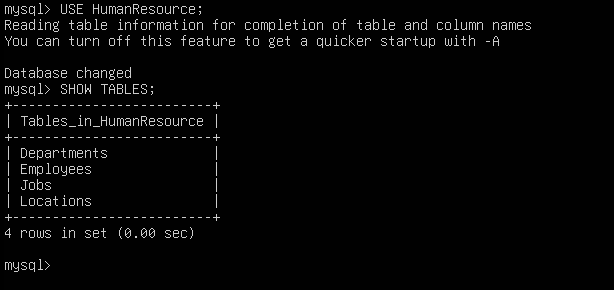
- **Reference Screenshot:** 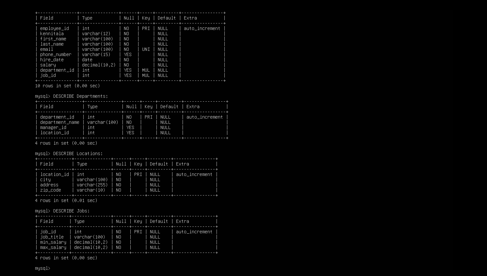

---

## 6. Automated Weekly Backup
A backup script was created to automatically back up user home directories every Friday at midnight. This was managed using a crontab entry on Server1.

- **Backup Script:** `scripts/backup_home.sh`
- **Configuration File:** `config_files/crontab_backup.txt`
- **Reference Screenshot:** 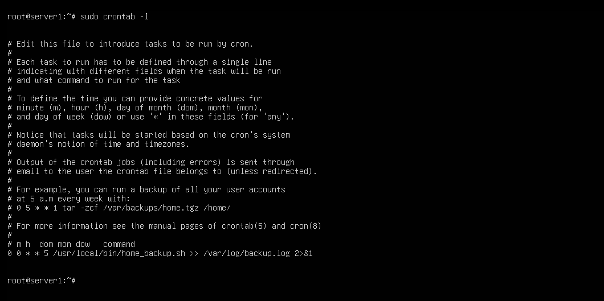

---

## 7. NTP Time Synchronization
The Network Time Protocol (NTP) was configured on Server1 as the master server, and both clients were set to sync their time with the server. This ensures all systems maintain accurate and synchronized time.

- **Configuration File:** `config_files/ntp.conf.txt`
- **Reference Screenshot:** 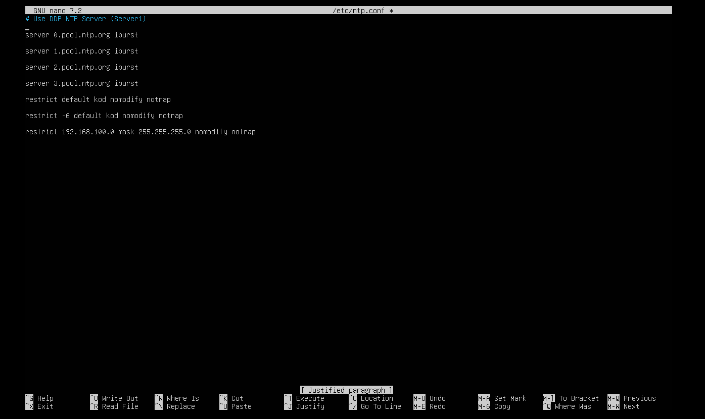
- **Reference Screenshot:** 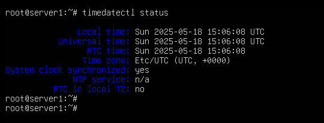

---

## 8. Centralized Logging with Syslog
Syslog was configured on Server1 to receive logs from Client1 and Client2. This allows centralized monitoring of log files for proactive management.

- **Configuration File:** `config_files/rsyslog.conf.txt`
- **Reference Screenshot:** 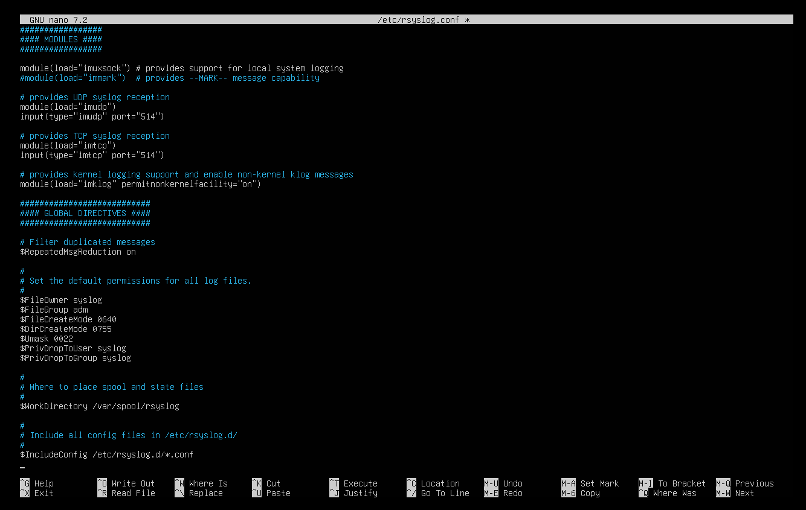
- **Reference Screenshot:** 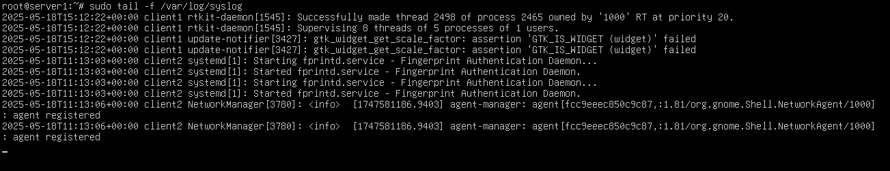

---

## 9. Postfix and Roundcube Email Setup
Postfix was installed as the email server, and Roundcube was set up as a webmail client. This allows users to send and receive emails within the network using their `ddp.is` email addresses.

- **Postfix Configuration:** `config_files/main.cf.txt`
- **Roundcube Configuration:** `config_files/config.inc.php.txt`
- **Reference Screenshot:** 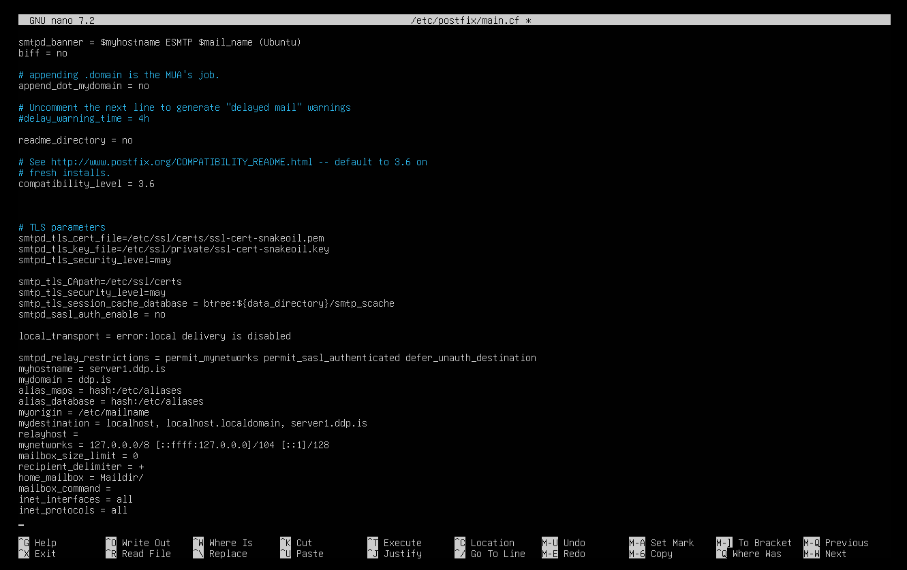
- **Reference Screenshot:** 

---

## 10. Shared Printer Configuration (CUPS)
CUPS (Common UNIX Printing System) was configured to provide shared printers. Access was restricted by user group, allowing only IT and Management users to manage printers, while other departments could only print.

- **Configuration File:** `config_files/cupsd.conf.txt`
- **Reference Screenshot:** 

---

## 11. Securing SSH with RSA Keys
SSH was secured using RSA key-based authentication. Password authentication was disabled, and only users in the IT and Management groups were granted SSH access.

- **Configuration File:** `config_files/sshd_config.txt`
- **Reference Screenshot:** 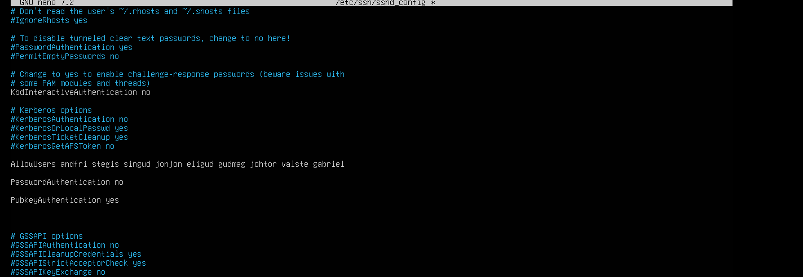
- **Reference Screenshot:** 

---

## 12. Securing the System with UFW and Nmap
Uncomplicated Firewall (UFW) was used to secure the server by allowing only necessary ports:
- SSH (22)
- HTTP (80), HTTPS (443)
- SMTP (25), IMAP (143)
- DNS (53)
- NTP (123)
- Syslog (514)
- CUPS (631)

Nmap was used to verify that only these ports were open.

- **Firewall Status:** `config_files/ufw_status.txt`
- **Reference Screenshot:** 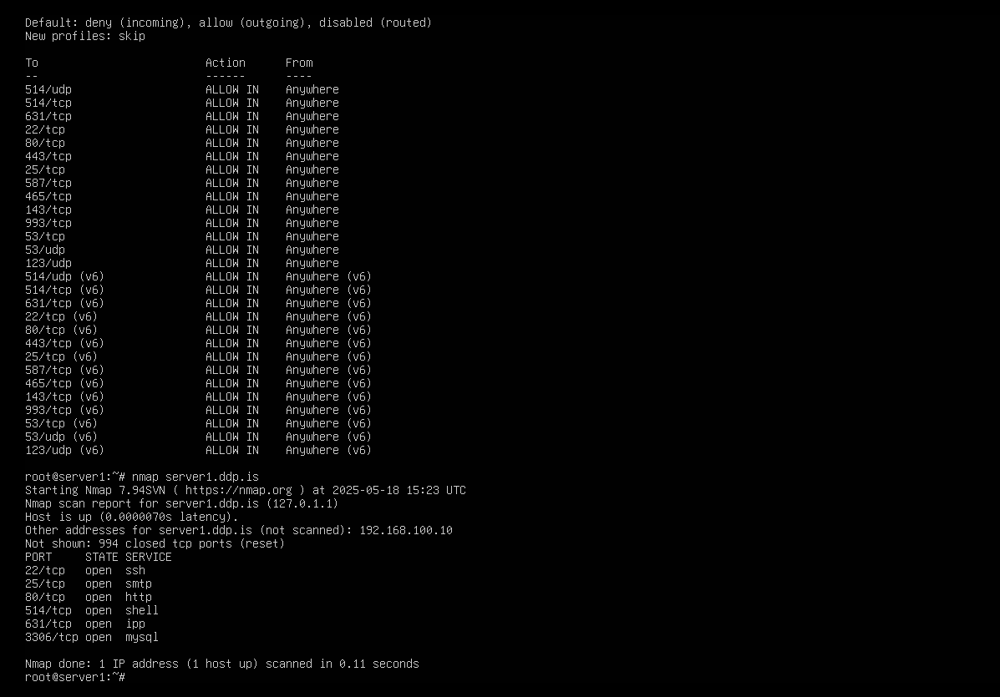

---

## Conclusion
This project demonstrated the process of setting up a secure and functional Linux server for a network domain, including DNS, DHCP, secure SSH, email, printers, logging, and secure access control.

- If you encounter any issues, refer to the configuration files in the `config_files` directory.
- For any questions, feel free to reach out.

---

